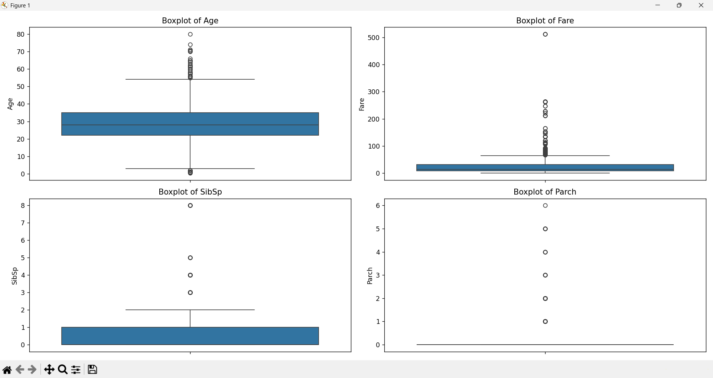
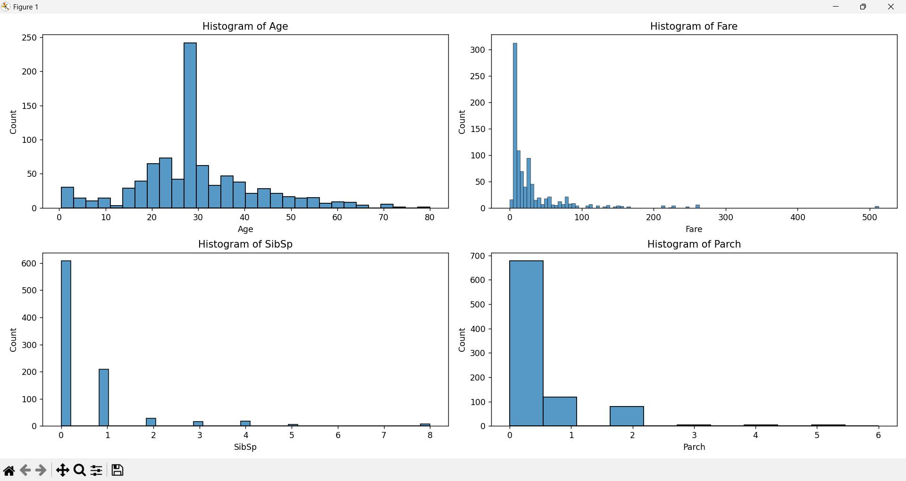
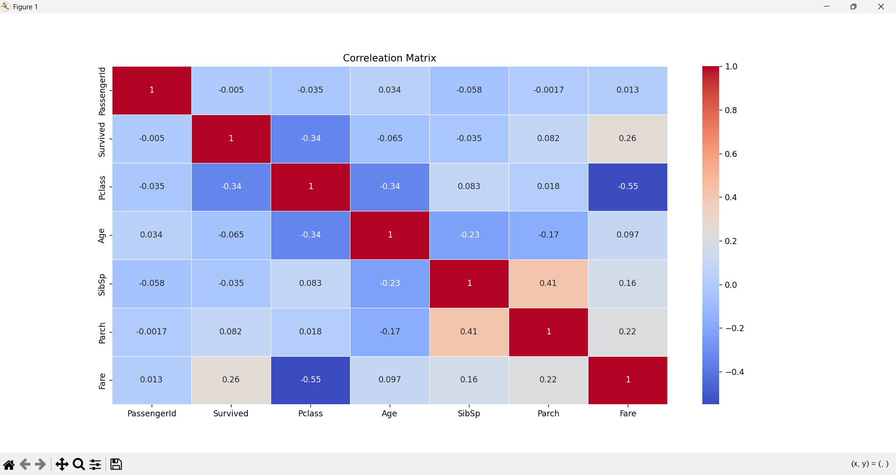

# Titanic Dataset EDA

## Overview
Exploratory Data Analysis (EDA) on the Titanic dataset using Python. This report covers summary statistics, data visualizations (histograms, boxplots, correlation matrix), and feature-level insights.

## Steps Performed
1. Generated summary statistics (mean, median, std, etc.).
2. Created histograms and boxplots for numeric features.
3. Visualized feature relationships using a correlation matrix.
4. Identified patterns, trends, and anomalies.
5. Made basic feature-level inferences from visuals.

## Visualizations

### Boxplots

### Histograms

### Correlation Matrix

## Key Findings

- **Age:** Most passengers were between 20-40 years old, with some outliers among very old passengers.
- **Fare:** Right-skewed distribution with a majority paying low fares, and several high-value outliers.
- **SibSp/Parch:** Most passengers traveled alone or with one family member; large families were rare.
- **Correlations:** Higher class and higher fare are positively correlated with survival.

## Project Structure

- `src/task2.py` — Main EDA code
- `images/` — Saved screenshots of plots
- `data/` —  Cleaned Titanic Dataset
- `README.md` — Project documentation

